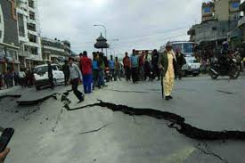

# AIDAR — AI Disaster Awareness and Response System

  <!-- optional image from assets -->

## 🚀 Project Overview
**AIDAR** is an AI-based disaster management system designed to help 
monitor, predict, and respond to natural disasters in India.  
It integrates multiple AI models, visualization tools, and a chatbot to 
provide real-time insights and risk assessments.

**Key Features:**
- Image classification of disaster events using CNN (TensorFlow)  
- Risk prediction using Random Forest model  
- Tweet classification for disaster-related information (HuggingFace 
DistilBERT)  
- Geospatial heatmaps with Folium and GeoJSON  
- Multilingual AI chatbot for disaster awareness  

---

## 📁 Project Structure

